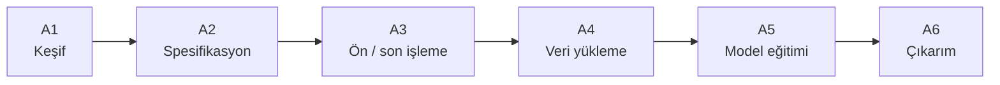
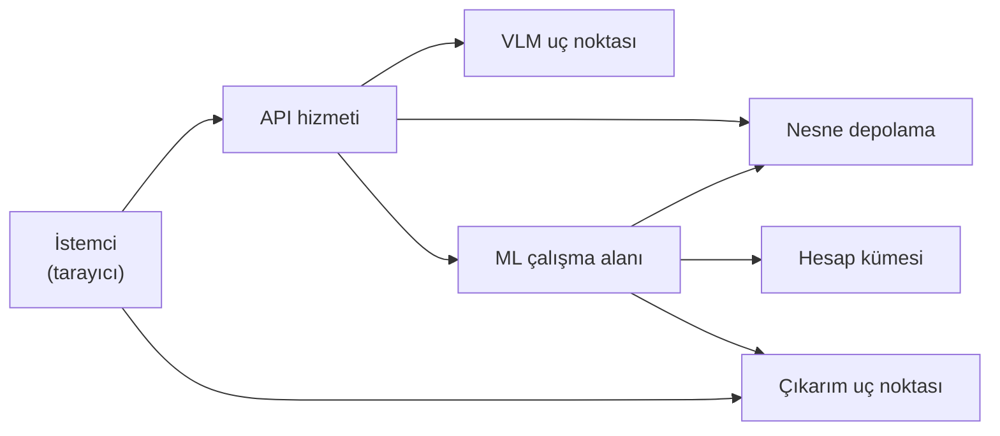

# VisionDock — Akademik Başvuru Eki: Sistem Mimarisi ve İş Akışı

> Bu bölüm başvuru dokümanına doğrudan aktarılmak üzere hazırlanmıştır.
> Şekil metinleri APA/IEEE uyumlu kısa açıklama biçimindedir.

---

## 1. Mantıksal sistem mimarisi

Önerilen platform üç ana mantıksal katmandan oluşur: (i) sunum, (ii) uygulama hizmetleri, (iii) veri kalıcılığı ile yönetilen yürütme. Yapay zekâ hizmetleri (çok kipli dil modeli ve eğitim orkestrasyonu) uygulama katmanı ile yürütme katmanı arasında konumlanır. Tüm adımlar ortak bir proje spesifikasyonu (**ProjectSpec**) üzerinden senkronize edilir.

```mermaid
flowchart TB
  subgraph L1["Sunum katmanı"]
    UI["Web arayüzü<br/>(keşif, veri, eğitim, çıkarım)"]
  end

  subgraph L2["Uygulama katmanı"]
    API["Uygulama programlama arayüzü<br/>(kimlik doğrulama, ProjectSpec, doğrulama)"]
  end

  subgraph L3["Yapay zekâ hizmetleri"]
    VLM["Çok kipli dil modeli (VLM)"]
    MLO["Eğitim orkestrasyonu"]
  end

  subgraph L4["Veri ve kalıcılık"]
    OBJ["Nesne depolama"]
    META["Metaveri / proje kaydı"]
    REG["Model kayıt defteri"]
  end

  subgraph L5["Yürütme katmanı"]
    CMP["Yönetilen hesap kümesi (CPU/GPU)"]
    INF["Çıkarım uç noktası / kenar paketi"]
  end

  UI --> API
  API --> VLM
  API --> MLO
  API --> OBJ
  API --> META
  MLO --> CMP
  MLO --> REG
  OBJ --> CMP
  REG --> INF
  API --> INF
```

**Şekil 1.** VisionDock mantıksal sistem mimarisi: sunum, uygulama, yapay zekâ hizmetleri, veri kalıcılığı ve yönetilen yürütme katmanları.

---

## 2. Uçtan uca iş akışı

Pilotot kullanım senaryosunda işlemler ardışıktır. Her adımın çıktısı bir sonraki adımın girdisidir. Merkezi artefakt ProjectSpec’tir. Platform bir etiketleme aracı değildir; kullanıcı önceden etiketlenmiş veri yükler.



**Şekil 2.** VisionDock uçtan uca iş akışı (A1–A6).

### Çizelge 1. İş akışı adımlarının girdi–çıktı ilişkisi

| Adım | Girdi | İşlem | Çıktı |
|------|-------|-------|-------|
| A1 Keşif | Örnek görüntü, diyalog | VLM ile yapılandırılmış slot doldurma | Görev tipi, sınıf/etiket adayları, hazırlık durumu |
| A2 Spesifikasyon | Keşif özeti | ProjectSpec üretimi, şema doğrulama, görev varsayılanları | Onaylı proje spesifikasyonu |
| A3 Ön / son işleme | ProjectSpec | Görev tipine göre ön/son işleme parametrelerinin belirlenmesi | Pipeline yapılandırması |
| A4 Veri yükleme | Etiketli veri seti | Biçim ve tutarlılık doğrulaması, depolama | Doğrulanmış veri referansı |
| A5 Model eğitimi | Spec + veri | Yönetilen bulut eğitim işi; metrik toplama | Model artefaktı, performans metrikleri |
| A6 Çıkarım | Eğitilmiş model | API veya kenar paket üzerinden skorlama | Tahminler (eşik, NMS vb. son işleme ile) |

---

## 3. Dağıtım ve bileşen etkileşimi

Referans uygulama bulut bilişim altyapısı üzerinde gerçekleştirilmiştir. Aşağıdaki diyagram mantıksal rolleri gösterir; eşdeğer hizmetler alternatif sağlayıcılarda karşılanabilir.



**Şekil 3.** Bileşen etkileşim diyagramı: istemci, API hizmeti, VLM, nesne depolama, makine öğrenmesi çalışma alanı, hesap kümesi ve çıkarım.

---

## 4. Desteklenen görev tipleri

### Çizelge 2. Bilgisayarla görme görev tipleri

| Görev tipi | Denetim sinyali | Tipik model ailesi |
|------------|-----------------|--------------------|
| Sınıflandırma | Tek sınıf / görüntü | Evrişimli sinir ağı (ör. EfficientNet) |
| Çok etiketli sınıflandırma | Çoklu etiket / görüntü | Evrişimli sinir ağı |
| Regresyon | Sürekli hedef değişken | Evrişimli sinir ağı |
| Nesne yerelleştirme | Tek sınırlayıcı kutu / görüntü | Tek aşamalı dedektör (YOLO ailesi) |
| Nesne tespiti | Çoklu sınırlayıcı kutu / görüntü | Tek aşamalı dedektör (YOLO ailesi) |

---

## 5. Ortak spesifikasyon sözleşmesi (ProjectSpec)

ProjectSpec; kullanıcı arayüzü, uygulama hizmeti, eğitim işi ve çıkarım bileşenleri arasında paylaşılan tek yapılandırma sözleşmesidir.

### Çizelge 3. ProjectSpec alan grupları

| Alan grubu | İşlev |
|------------|-------|
| Görev tanımı | Görev tipi, sınıf/etiket listesi, (varsa) hedef değişken |
| Eğitim yapılandırması | Dönem sayısı, yığın boyutu, öğrenme oranı, girdi çözünürlüğü |
| Ön işleme | Yeniden boyutlandırma, normalizasyon, gri tonlama vb. |
| Son işleme | Güven eşiği, NMS, dışa aktarım biçimleri |
| Donanım tahmini | Süre ve maliyet üst sınırına ilişkin bilgilendirme |

---

## Metin içi atıf örneği

Önerilen sistemin mantıksal mimarisi Şekil 1’de, uçtan uca işlem boru hattı Şekil 2’de, bileşen etkileşimi ise Şekil 3’te gösterilmiştir. Desteklenen görev tipleri Çizelge 2’de; ortak spesifikasyon sözleşmesi Çizelge 3’te özetlenmiştir.
