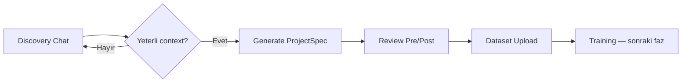

# VisionDock — Product Architecture (v1)

## Hedef akış



| Faz | Kullanıcı ne yapar | Sistem ne yapar |
|-----|-------------------|-----------------|
| **1. Discovery** | Görsel yükler, sohbet eder | VLM slot doldurur, eksikleri sorar |
| **2. Config** | Öneriyi onaylar / düzenler | `ProjectSpec` JSON üretir + şema doğrular |
| **3. Pre/Post** | Pipeline ayarlarını inceleyip düzenler | Task tipine göre varsayılan + kullanıcı override |
| **4. Dataset** | Etiketli veri yükler | Blob’a kayıt, sınıf listesiyle doğrulama |
| **5. Training** | (Sonraki konu) | Azure ML job |

---

## Discovery: “Ne yapmak istiyorsun?”

VLM serbest sohbet değil, **yapılandırılmış keşif** yapmalı. Doldurulması gereken slotlar:

| Slot | Örnek soru |
|------|------------|
| `use_case` | Ne tespit / sınıflandırılacak? |
| `task_type` | classification / detection / anomaly / segmentation |
| `objects_or_defects` | Hangi nesne veya kusur tipleri? |
| `environment` | Hat içi, dış mekân, sabit kamera? |
| `throughput` | FPS / latency beklentisi? |
| `labeling` | Bounding box, mask, sadece OK/NOK? |

**Hazır olma kriteri** (backend):

- En az 2 kullanıcı turu **ve**
- `task_type` net **ve**
- `objects_or_defects` dolu **ve**
- Asistan mesajında `**Ready for configuration**` (VLM sinyali)

API: `POST /api/vlm/analyze` → `{ response, ready_for_config, discovery, detected_task }`

---

## ProjectSpec: tek kaynak

Tüm adımlar aynı JSON şemasını kullanır (`api/schemas/project_spec.py`):

- `project_name`, `task_type`, `classes`, `description`
- `training_config`
- `preprocessing` — eğitim/çıkarım öncesi görüntü dönüşümü
- `postprocessing` — threshold, NMS, export formatları
- `hardware_requirements` — tahmin (eğitim fazında Azure ML ile güncellenir)

`generate-config` bu şemaya göre validate eder; task tipine göre **varsayılan pre/post** ekler.

---

## Preprocessing / Postprocessing nasıl handle edilir?

### Kavram

| | Preprocessing | Postprocessing |
|---|----------------|----------------|
| **Ne zaman** | Eğitim + inference **öncesi** | Model çıktısı **sonrası** |
| **Kim uygular** | Data pipeline (batch) | Inference servisi |
| **Örnek** | resize, normalize, grayscale | confidence threshold, NMS, TTA |

### Ürün içi (şimdi)

1. VLM + kural motoru **ilk öneriyi** üretir (`apply_task_defaults`).
2. Kullanıcı UI’da **düzenler** (toggle, sayı, çözünürlük).
3. Onaylanan spec **Blob + DB**’ye yazılır (Faz 1.5).
4. Eğitim job’u spec’i okuyup pipeline çalıştırır (Faz 2).

### Azure’da ne kullanılır?

| İhtiyaç | Azure servisi | Not |
|---------|---------------|-----|
| VLM / chat | **Azure OpenAI** | Mevcut |
| Spec + proje metadata | **Cosmos DB** veya **PostgreSQL Flexible** | Küçük hacim için Postgres yeterli |
| Görseller / dataset ZIP | **Blob Storage** | `samples/`, `datasets/`, `configs/` |
| Async preprocess batch | **Azure Functions** veya **Container Apps Jobs** | OpenCV/albumentations container |
| Training (sonra) | **Azure Machine Learning** | Compute cluster, pipeline, model registry |
| Managed CV (alternatif) | **Custom Vision** | Hızlı PoC; tam kontrol için ML tercih |
| Inference (sonra) | **Azure ML endpoint** veya **App Service + ONNX** | Postprocessing API katmanında |
| Secrets | **Key Vault** | API keys, connection strings |
| Orchestration | **Service Bus** + **Event Grid** | dataset uploaded → validate → preprocess → train |

**Hazır “preprocessing servisi” yok** — Azure görüntü işleme kütüphanesi sunmaz; **kendi kodunuzu** Blob + Functions/AML pipeline üzerinde çalıştırırsınız.

Önerilen Blob layout:

```
visiondock/{project_id}/
  samples/           # keşif görselleri
  config/
    project-spec.v1.json
  datasets/raw/
  datasets/processed/  # preprocess çıktısı
  models/
```

---

## Model eğitimi (sonraki konuşma — kısa çerçeve)

- **ProjectSpec** → AML pipeline YAML veya Python command job
- Preprocess step: spec’ten `preprocessing` oku
- Train step: `task_type` → YOLO / torchvision / anomaly lib
- Register model → inference endpoint spec’teki `postprocessing` uygular

---

## Bu repoda uygulanan (v1 kod)

- Yapılandırılmış discovery yanıtı + ilerleme yüzdesi
- `ready_for_config` ile Generate Config kilidi
- Task tipine göre pre/post varsayılanları
- Config panelinde preprocessing / postprocessing düzenleme
