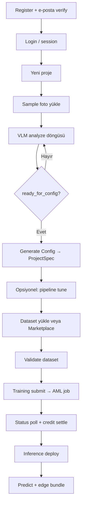

# VisionDock — Sistem Dokümantasyonu

Bu belge VisionDock ürününün **uçtan uca teknik mimarisini** anlatır: kimlik doğrulama, VLM discovery sohbeti, Generate Config, dataset yükleme, Azure ML eğitimi, marketplace, inference ve kredi sistemi. Kaynak kod: `api/` (FastAPI) + `artifacts/visiondock/` (React SPA).

> Son güncelleme: kod tabanı ile senkron (2026). Eski `docs/PRODUCT-ARCHITECTURE.md` yüksek seviye ürün vizyonudur; **bu dosya gerçek implementasyonun kaynağıdır**.

---

## İçindekiler

1. [Mimari özeti](#1-mimari-özeti)
2. [Kimlik doğrulama ve e-posta](#2-kimlik-doğrulama-ve-e-posta)
3. [VLM Discovery sohbeti](#3-vlm-discovery-sohbeti)
4. [Generate Config ve ProjectSpec](#4-generate-config-ve-projectspec)
5. [Dataset yükleme ve doğrulama](#5-dataset-yükleme-ve-doğrulama)
6. [Eğitim (Azure ML) altyapısı](#6-eğitim-azure-ml-altyapısı)
7. [Dataset ve Model Marketplace](#7-dataset-ve-model-marketplace)
8. [Inference (deploy + predict)](#8-inference-deploy--predict)
9. [Kredi ve faturalama](#9-kredi-ve-faturalama)
10. [API rotaları](#10-api-rotaları)
11. [Ortam değişkenleri](#11-ortam-değişkenleri)
12. [Uçtan uca kullanıcı akışı](#12-uçtan-uca-kullanıcı-akışı)
13. [Depo yapısı](#13-depo-yapısı)

---

## 1. Mimari özeti

### 1.1 Bileşenler

| Katman | Konum | Teknoloji | Görev |
|--------|--------|-----------|--------|
| Frontend SPA | `artifacts/visiondock/` | React 18, Vite, Tailwind, Zustand | UI: login, home, projects, models, datasets, inference, billing |
| Backend API | `api/` | FastAPI + Uvicorn/Gunicorn | REST API, VLM, auth, AML orchestration |
| Statik UI (prod) | `api/static/` | Vite build çıktısı | Aynı origin’den SPA + API |
| Veritabanı | Azure Postgres Flexible Server | SQLAlchemy | Kullanıcılar, oturumlar, kredi ledger, e-posta log |
| Blob storage | Azure Blob (`visiondock` container) | `storage/blob_store.py` | Projeler, sample’lar, dataset’ler, marketplace kataloğu |
| VLM | Azure OpenAI | `services/vlm_client.py` | Discovery chat + assess + generate-config + pipeline tune |
| Eğitim / Inference | Azure Machine Learning | `azure_ml_service.py`, `inference_service.py` | Command job training + managed online endpoint |
| E-posta | SMTP (ör. Brevo) | `email_service.py` | Signup welcome + verify link |
| Observability (opsiyonel) | Langfuse | `vlm_client.py` | VLM çağrı izleri |

### 1.2 İstek yolu (production)

```
Tarayıcı
  → HTTPS (App Service: örn. visiondock-app.azurewebsites.net)
    → Session cookie (SessionMiddleware + SessionAuthMiddleware)
      → FastAPI router’lar
        → Postgres (auth / credits)
        → Blob (project / dataset / marketplace)
        → Azure OpenAI (VLM)
        → Azure ML (training job / online endpoint)
```

Frontend production build’de `VITE_API_URL=""` ile **same-origin** API kullanır (`scripts/deploy-visiondock-azure.sh`). Ayrı Static Web Apps deploy’unda `VITE_API_URL` App Service URL’ine işaret eder.

### 1.3 Desteklenen task tipleri

Ürün **yalnızca** şu beş CV görevini destekler (`api/schemas/project_spec.py`, `api/discovery.py`):

| `task_type` | Anlamı | Varsayılan model | Girdi formatı |
|-------------|--------|------------------|---------------|
| `classification` | Foto başına tek sınıf | EfficientNet-B0 | Klasör başına sınıf |
| `multi_label` | Aynı fotoğraf birden fazla etiket | EfficientNet-B0 | images/ + CSV/JSON |
| `regression` | Foto başına sayısal hedef | EfficientNet-B0 | images/ + `image,target` CSV |
| `object_localization` | Foto başına tek kutu | YOLOv8n | YOLO/COCO/VOC ZIP |
| `object_detection` | Foto başına çoklu kutu | YOLOv8m | YOLO/COCO/VOC ZIP |

Segmentation, anomaly detection vb. ürün kapsamı dışındadır; VLM prompt’ları bunu dayatır.

---

## 2. Kimlik doğrulama ve e-posta

**Dosyalar:** `api/routers/auth.py`, `api/session_auth.py`, `api/services/user_store.py`, `api/services/user_sessions.py`, `api/services/email_service.py`, `api/services/password.py`

### 2.1 Modlar

| Mod | Ne zaman | Açıklama |
|-----|----------|----------|
| DB email/password | `AUTH_DB_USERS=true`, signup açık | Asıl üretim yolu |
| Env admin | `AUTH_USERNAME` / `AUTH_PASSWORD` | Acil admin girişi (DB user değil) |
| Google OAuth | `GOOGLE_CLIENT_ID/SECRET` | Opsiyonel |
| Microsoft OAuth | `MICROSOFT_CLIENT_ID/SECRET` | Opsiyonel |
| Kapalı | `AUTH_ENABLED=false` | Geliştirme |

### 2.2 Middleware

`install_session_auth` iki katman kurar:

1. **Starlette `SessionMiddleware`** — imzalı cookie session (`SESSION_SECRET`).
2. **`SessionAuthMiddleware`** — korumalı `/api/*` için login zorunlu.

**Public (auth gerekmez):** `/api/auth/*`, `/api/health`, `/api/training/info`, `/`, SPA asset’leri.

API çağrılarında DB oturumu varsa `UserSession` aktif olmalı. `AUTH_REQUIRE_EMAIL_VERIFY` (varsayılan true) iken `email_verified_at` boşsa → `403 email_unverified`.

Cookie’ler production’da (`WEBSITE_HOSTNAME` veya `ENVIRONMENT=production`) HTTPS-only.

### 2.3 Signup akışı

```
POST /api/auth/register { email, password, name? }
  → UserStore.register_email_user
  → verify token üretilir
  → send_welcome_email (SMTP varsa gönderilir; yoksa email_messages tablosuna captured)
  → Session AÇILMAZ
  → { requires_email_verification: true, email_sent, email_status }
```

Kullanıcı e-postadaki linke tıklar:

```
GET /api/auth/verify-email?token=…
  → token doğrulanır, email_verified_at set
  → login session + refresh cookie
  → Redirect: FRONTEND_URL/?email_verified=1&fresh_login=1
```

Verify URL: `{PUBLIC_API_URL}/api/auth/verify-email?token=…`

Yeniden gönderim: `POST /api/auth/resend-verification`.

### 2.4 Login / session

- `POST /api/auth/login` — DB user (doğrulanmamışsa blok) veya env credentials.
- Başarılı DB login: session + `create_login_session` + httponly `visiondock_refresh` (path `/api/auth`, ~30 gün).
- `POST /api/auth/refresh` — refresh cookie ile session yenileme.
- `POST /api/auth/logout`, `GET /api/auth/sessions`, `DELETE /api/auth/sessions/{id}`.

### 2.5 E-posta altyapısı

`email_service.py`:

- Gönderim için `SMTP_HOST` + `EMAIL_FROM` zorunlu.
- `SMTP_PORT` (587), `SMTP_USER`, `SMTP_PASSWORD`, `SMTP_STARTTLS` / `SMTP_SSL`.
- SMTP yoksa mail **yakalanır** (`status=captured`) ve loglanır — signup yine çalışır ama kullanıcıya mail gitmez.
- `GET /api/auth/config` → `email_delivery: true/false`, `email_verify_required`, `signup` bayrakları.

Yeni kullanıcıya genelde **`signup_grant`** ile ücretsiz kredi verilir (bkz. bölüm 9).

---

## 3. VLM Discovery sohbeti

**Endpoint:** `POST /api/vlm/analyze`  
**Modüller:** `api/main.py` (`_build_openai_messages`), `api/discovery.py`, `api/services/vlm_client.py`

Discovery, serbest sohbet değil: **slot tabanlı keşif**. Her kullanıcı mesajında en az iki LLM çağrısı vardır:

| Çağrı | Amaç | Çıktı |
|-------|------|--------|
| 1. Chat completion | Kullanıcıya doğal dil cevabı | `response` (assistant metni) |
| 2. Assess (JSON) | Slot / hazırlık değerlendirmesi | `ready_for_config`, `slots`, `progress_percent`, … |

### 3.1 Sample fotoğraflar

- UI Step 1’de kullanıcı örnek foto yükler → `POST /api/projects/{id}/samples`.
- Blob: `projects/{id}/samples/`.
- Analyze sırasında `_images_from_project_samples`: en fazla **2** görsel; `>450KB` olanlar atlanır.
- Request body’de `images` (data URL / http) de gelebilir; data URL `>280KB` drop edilir.
- Vision, yalnızca erken turda (`user_turns <= 1`) eklenir; vision/rate hatasında text-only retry.

### 3.2 Chat system prompt (özet)

`main.py` içindeki system prompt:

- Kullanıcı mühendis değil; kısa, sade dil.
- VisionDock **etiketleme aracı değildir** — kullanıcı önceden etiketli dataset getirir.
- Beş task tipi açıkça listelenir.
- İlk cevap: gördüklerini özetle, muhtemel task’ı öner, en fazla 3 soru.
- “Generate Config’e hazırsın” deme — UI readiness’i **assess JSON**’dan alır.
- Wrap-up yalnızca slotlar doluyken: `"Here's what I suggest:"` + task adı + tüm class’lar + Generate Config butonuna yönlendirme.
- Greeting / “ok” / sadece görsel = yeterli değil.

### 3.3 Assess JSON (`ASSESS_SYSTEM`)

`discovery.py` → `assess_discovery_with_llm`.

**Slotlar:**

| Slot | Anlamı |
|------|--------|
| `use_case` | Ne yapmak istiyor (gerçek hedef) |
| `task_type` | Beş tipten biri net |
| `objects_or_defects` | Sınıf adları veya regression hedefi |
| `environment` | Kamera / görüntü kaynağı |
| `throughput` | Hız / latency ihtiyacı |

**Zorunlu:** `use_case`, `task_type`, `objects_or_defects`  
**Bağlam (en az biri):** `environment` **veya** `throughput`

`ready_for_config=true` yalnızca:

1. Zorunlu slotlar USER cevabından dolu,
2. environment veya throughput dolu,
3. USER substantive cevap vermiş veya özeti onaylamış.

Asistanın tek başına özet yazması yeterli **değildir**.

API cevabında tipik alanlar:

```json
{
  "response": "…assistant text…",
  "ready_for_config": true,
  "detected_task": "classification",
  "slots": { "use_case": true, "task_type": true, "…" },
  "missing_slots": [],
  "progress_percent": 85,
  "extracted_labels": ["ok", "defect"],
  "regression_target": null
}
```

### 3.4 Kredi

Cevap boş değilse: `debit_from_request(..., reason="vlm_analyze")` (tipik **1 kredi**). Önce bakiye kontrolü.

### 3.5 Model istemcisi

- Env: `VLM_API_KEY`, `VLM_ENDPOINT` (`…/openai/v1`), `VLM_MODEL` (prod’da genelde `gpt-5-mini`).
- Reasoning modeller (`gpt-5*`, `o1`…) için `max_completion_tokens` + düşük reasoning effort (`vlm_json_kwargs`).
- Langfuse açıksa OpenAI wrapper üzerinden trace.

---

## 4. Generate Config ve ProjectSpec

**Endpoint:** `POST /api/vlm/generate-config`  
**Body:** chat history + `project_id` + opsiyonel `force: true`

### 4.1 Adımlar (kod sırası)

1. Discovery transcript üzerinden **yeniden assess**.
2. `ready_for_config` false ve `force` yoksa → `400`.
3. `resolve_task_type_with_llm` (`RESOLVE_TASK_SYSTEM`) → tek `task_type` kilidi.
4. Üçüncü LLM çağrısı: ProjectSpec şeklinde JSON üret.
5. `parse_project_spec` → şema zorlama / tip coercion.
6. `apply_resolved_task_type` + assess’ten gelen class / target birleştirme.
7. `apply_task_defaults` — model, image size, NMS, export format.
8. Projeye `save_spec` / chat kaydı.
9. Debit `generate_config`.

### 4.2 ProjectSpec (`api/schemas/project_spec.py`)

`spec_version: "1.0"`. Önemli alanlar:

- `project_name`, `task_type`, `recommended_model`, `description`
- `classes: string[]` (classification / multi_label / detection)
- `target_name`, `target_unit` (regression)
- `estimated_dataset_size`
- `training_config` (epochs, batch, lr, …)
- `preprocessing` / `postprocessing`
- `hardware_requirements`

LLM bazen bozuk tipler döner; validator’lar resize string’lerini, bool map’leri, `export_format` listelerini normalize eder.

### 4.3 Task defaults

| Task | `recommended_model` | Image size | Not |
|------|---------------------|------------|-----|
| classification | EfficientNet-B0 | 224×224 | NMS 0; onnx + torchscript |
| multi_label | EfficientNet-B0 | 224×224 | aynı |
| regression | EfficientNet-B0 | 224×224 | `target_name` soft default |
| object_localization | YOLOv8n | 640×640 | NMS ~0.5 |
| object_detection | YOLOv8m | 640×640 | NMS ~0.5 |

### 4.4 Pipeline tune (Step 3)

`POST /api/projects/{id}/pipeline/tune` → `services/pipeline_tuning.py`

- Dataset’ten ≤6 örnek görsel.
- VLM training/pre/post JSON + gerekçe üretir, spec’e merge eder.
- Debit: `pipeline_tune`.
- Aynı proje için tekrar ziyarette **cache / lock** ile çift ücret önlenir (projede tune cache).

UI’da kullanıcı pipeline editörüyle (`config-pipeline-editor.tsx`) override edebilir; kaydedilen spec blob’da tutulur.

---

## 5. Dataset yükleme ve doğrulama

**Doğrulama:** `api/dataset_validation.py`  
**Depolama:** `ProjectStore` + `BlobStore`  
**Router:** `api/routers/projects.py` (`/api/projects/{id}/dataset…`)

### 5.1 Blob layout

```
projects/{project_id}/meta.json
projects/{project_id}/config/…          # ProjectSpec
projects/{project_id}/chat/…
projects/{project_id}/samples/          # Discovery örnekleri
projects/{project_id}/datasets/
  classification/{ClassName}/img.jpg
  multi_label/images/… + manifest
  regression/images/… + targets.csv
  annotated/dataset.zip                 # YOLO/COCO/VOC
```

### 5.2 Task’e göre kurallar

| Task | Upload | Minimum | Notlar |
|------|--------|---------|--------|
| classification | Sınıf klasörleri veya ZIP | `MIN_IMAGES_PER_CLASS` (default **5**) dolu sınıf | Spec’teki `classes` ile klasör adları eşleşmeli |
| multi_label | images + CSV/JSON | `MIN_DATASET_IMAGES` (default **10**) | Satır başına çoklu label |
| regression | images + CSV `image,target` | ≥10 çift | `target_name` spec’ten |
| localization / detection | annotated ZIP | format detect | **yolo** / **coco** / **voc** (`_detect_annotation_format`) |

- İzinli uzantılar: `.jpg/.jpeg/.png/.bmp/.webp`
- ZIP üst limiti: `MAX_DATASET_ZIP_BYTES` (default 512MB)
- Çakışmayı önlemek için dosya adları `{12hex}_{original}` olabilir (CSV eşlemesi buna göre)

### 5.3 Model template projelerinde class kilidi yok

Marketplace’ten **model** ile Start Project:

- Spec’e katalog class’ları **kilitlenmez** (`classes: []`).
- Katalog örnekleri `model_template.example_classes` olarak saklanır.
- Step 2’de kullanıcı **kendi etiketlerini / klasörlerini** tanımlar.

Bu, `marketplace_import.py` → `bootstrap_project_from_model` davranışıyla garanti edilir.

### 5.4 Setup tamamlama

`POST /api/projects/{id}/complete-setup` — dataset doğrulandıktan sonra proje meta’sını “hazır / training’e geçilebilir” durumuna alır.

---

## 6. Eğitim (Azure ML) altyapısı

**Router:** `api/routers/training.py` → `/api/training`  
**Servis:** `api/services/azure_ml_service.py`  
**Script’ler:** `api/training_scripts/`  
**Kuyruk:** `training_submit_queue.py` (arka plan submit)

### 6.1 Submit akışı

```
POST /api/training/submit { project_id, … }
  1. Erişim + kredi rezervi (training_submit) — henüz kesin debit yok
  2. Spec + pipeline + dataset blob key çözülür
  3a. TRAINING_MOCK / AML yok → sahte Completed + settle_training_compute
  3b. Azure → planlanan job_id, background start_submission
       → MLClient.jobs.create_or_update (command job)
  4. UI poll: GET /api/training/status/{job_id}
  5. Terminal durum (Completed|Failed|Cancelled):
       _maybe_settle_training_credits → reason=training_compute
       (süre × VM $/saat; min TRAINING_MIN_SECONDS ≈ 15 dk)
```

**Kritik:** Status poll sırasında training meta güncellenirken `billed_user_id` gibi billing alanları **silinmemeli**; aksi halde settle çalışmaz (geçmişte bu bug düzeltildi).

### 6.2 Task → script eşlemesi

| `task_type` | Script | Runtime notları |
|-------------|--------|-----------------|
| classification | `aml_train_classification.py` | torchvision EfficientNet; ZIP veya classification prefix |
| multi_label | `aml_train_multi_label.py` | `MULTI_LABEL_PREFIX` |
| regression | `aml_train_regression.py` | `TARGET_NAME`, `LOSS_TYPE` |
| object_localization / object_detection | `aml_train_yolo.py` | ultralytics; weights default `yolov8m.pt` (localization için n) |

Ortak yardımcılar:

- `visiondock_preprocess.py`
- `visiondock_augment.py`
- `visiondock_postprocess.py`

Job, dataset’i Blob’dan okumak için `AZURE_STORAGE_CONNECTION_STRING` (ve container) env ile çalışır.

### 6.3 Compute ve environment

| Ayar | Tipik değer | Açıklama |
|------|-------------|----------|
| `AZURE_ML_COMPUTE` | `cpu-cluster` | Free trial’da GPU kotası yoksa D4s_v3 |
| `AZURE_ML_VM_SIZE` | `Standard_D4s_v3` veya `Standard_NC4as_T4_v3` | Fiyatlandırma + GPU info |
| `AZURE_ML_ENVIRONMENT` | curated PyTorch GPU env | `AzureML-ACPT-pytorch-1.13-py38-cuda11.7-gpu:1` |
| `AZURE_ML_WORKSPACE` | `visiondock-ml` | Workspace adı |
| `AZURE_RESOURCE_GROUP` | `visiondock-rg` | RG |
| `AZURE_SUBSCRIPTION_ID` | … | Abonelik |

App Service **Managed Identity** ile workspace’e Contributor / AzureML Data Scientist ve storage’a Blob Data Contributor atanır (`scripts/configure-azure-ml-access.sh`).

Cluster `min_instances=0` ise idle’da VM ücreti yok; job gelince scale-up.

### 6.4 Diğer training endpoint’leri

- `GET /api/training/info` — workspace/compute/sdk durumu (auth’suz public)
- `POST /api/training/cancel/{job_id}`
- `GET /api/training/models`
- `POST /api/training/deploy` — eski/yardımcı AML deploy yolu (asıl ürün inference router’ı kullanır)

### 6.5 UI

`training-progress.tsx`, `training-metrics-panel.tsx`, `use-training-info.ts` — job durumu, tahmini süre/maliyet (`azure_pricing` + info endpoint), AML Studio linki (`AZURE_ML_STUDIO_TENANT_ID`).

---

## 7. Dataset ve Model Marketplace

**Router:** `api/routers/marketplace.py`  
**Store:** `services/marketplace_store.py`  
**Import:** `services/marketplace_import.py` (+ `marketplace_import_queue.py`)  
**Şema:** `schemas/marketplace.py`  
**Katalog:** Blob/local `marketplace/catalog.json`  
**Seed script’leri:** `scripts/seed-marketplace.py`, `sync-marketplace-catalog.py`, `finalize-marketplace.py`, `seed-utkface-only.py`

### 7.1 Katalog öğeleri

**Dataset item:** `id`, `name`, `task_type`, `storage_prefix`, `format`, `classes`, `image_count`, `size_bytes`, license, tags, …

**Model item:** `id`, architecture, `task_type`, metrics, weights path, example classes, …

Frontend: `pages/datasets.tsx`, `pages/models.tsx`, `lib/marketplace-api.ts`, `marketplace-copy.ts`, guide/hover bileşenleri.

### 7.2 Dataset → Start Project

1. Kullanıcı dataset seçer → `start-project` / import.
2. Yeni proje oluşur; task tipi dataset ile uyumlu olmalı.
3. `link_dataset_from_marketplace` veya async kopya (`import queue`) blob prefix’ini projeye bağlar.
4. Kullanıcı Step 2’de kendi verisini de yükleyebilir / üzerine yazabilir.

### 7.3 Model → Start Project

1. `bootstrap_project_from_model` / `import_model`.
2. ProjectSpec yazılır; weights kopyalanır.
3. **`classes: []`** — müşteri kendi etiketlerini kullanır; katalog class’ları sadece örnek.
4. İsteğe bağlı: eğitim atlanıp doğrudan inference’a giden “hazır ağırlık” yolu.

### 7.4 Seed / veri politikası

Seed script’leri Imagenette, CIFAR-10, VOC, UTKFace, COCO128, `yolov8n.pt` vb. indirebilir.  
Yarım / bozuk blob’lar ürünü bozar; yeni ortamda **eksik artifact kopyalamamak** tercih edilir. Katalog metadata’sı (`catalog.json`) UI listesi için yeterlidir; import anında blob’lar hazır olmalıdır.

---

## 8. Inference (deploy + predict)

**Router:** `api/routers/inference.py` → `/api/inference/{project_id}`  
**Servis:** `api/services/inference_service.py`  
**Scoring script’leri:** `api/inference_scripts/`

### 8.1 Akış

```
Eğitim Completed (veya marketplace model weights)
  → POST /api/inference/{id}/deploy
       • model artifact boyutu hesaplanır
       • inference_deploy kredisi (VM saati + boyut tabanlı)
       • AML managed online endpoint + deployment
       • instance_type: AZURE_ML_INFERENCE_VM (örn. Standard_F2s_v2)
  → GET /api/inference/{id}  (status: deploying|deployed|failed)
  → POST /api/inference/{id}/predict
       • multipart image veya JSON image_base64
       • scoring URI + AML key
       • debit inference_predict
```

Ek:

- `POST …/api-key` — scoring anahtarı rotate / ensure
- `GET …/edge-bundle` — edge paket indirme

### 8.2 Scoring

| Model ailesi | Script | Not |
|--------------|--------|-----|
| EfficientNet (cls / multi / reg) | `score_classification.py` | Torch checkpoint |
| YOLO | `score_yolo.py` | + `tiled_detection.py`, `ensemble_detection.py` |

Pre/post: `visiondock_preprocess.py`, `visiondock_postprocess.py` (inference_scripts altında).

### 8.3 Maliyet uyarısı

Managed endpoint **ayakta kaldığı sürece** VM ücreti yazar (F2s_v2 ≈ $0.10/saat). Test bitince endpoint silinmeli. Deploy anında ürün, `INFERENCE_ENDPOINT_BILLED_HOURS` (default ~2 saat) kadar peşin kredi keser; uzun süre açık bırakmak Azure faturasını şişirir.

---

## 9. Kredi ve faturalama

**Modüller:** `services/credits.py`, `services/azure_pricing.py`, `routers/credits.py`  
**Tablolar:** `users.credits_balance`, `credit_ledger`, `usage_events`

### 9.1 Dönüşüm

- `1 credit ≈ $0.01` Azure maliyeti (`CREDIT_USD`)
- Opsiyonel `CREDIT_PLATFORM_MARKUP` (>1 margin)

### 9.2 Reason kodları

| Reason | Ne zaman | Tipik tutar |
|--------|----------|-------------|
| `signup_grant` | Yeni kullanıcı | ~100 (`FREE_PLAN_CREDITS`) |
| `vlm_analyze` | Discovery mesaj cevabı | 1 |
| `generate_config` | Spec üretimi | 1 |
| `pipeline_tune` | Pipeline tune | 1 |
| `training_submit` | Submit öncesi **rezerv** (~30 dk VM) | ~11 (D4s) |
| `training_compute` | Job bitince settle (gerçek süre) | değişken |
| `inference_deploy` | Endpoint deploy | boyut + ~2h VM |
| `inference_predict` | Her predict | ~1 |

### 9.3 Planlar

`PLANS`: free (100), starter (500), pro (2000).  
`POST /api/credits/activate-plan` — ödeme entegrasyonu yok; plan aktivasyonu + kredi.

UI: `pages/billing.tsx`, `hooks/use-credits.ts`, `lib/credits-api.ts`.

### 9.4 API

- `GET /api/credits/me` — bakiye, plan, son hareketler
- `GET /api/credits/costs` — aksiyon başına tahmini kredi

---

## 10. API rotaları

### Auth — `/api/auth`

| Method | Path | Açıklama |
|--------|------|----------|
| GET | `/config` | Signup/OAuth/email bayrakları |
| GET | `/me` | Oturum bilgisi |
| POST | `/register` | Signup |
| POST | `/login` | Login |
| POST | `/refresh` | Session yenile |
| POST | `/logout` | Çıkış |
| GET | `/sessions` | Aktif oturumlar |
| DELETE | `/sessions/{id}` | Oturum iptal |
| GET | `/verify-email` | E-posta doğrula + redirect |
| POST | `/resend-verification` | Mail yeniden gönder |
| GET | `/google/login`, `/google/callback` | Google OAuth |
| GET | `/microsoft/login`, `/microsoft/callback` | Microsoft OAuth |
| POST | `/admin/wipe-users` | Admin wipe (`X-Admin-Wipe-Secret`) |

### VLM (app) — `/api/vlm`

| Method | Path | Açıklama |
|--------|------|----------|
| POST | `/analyze` | Discovery chat + assess |
| POST | `/generate-config` | ProjectSpec üret |

### Projects — `/api/projects`

CRUD; discovery state; spec get/put; chat; samples;  
`pipeline/tune`; dataset classification / multi_label / regression / annotated / validate / status;  
`complete-setup`; marketplace import bağlantıları.

### Training — `/api/training`

`info`, `submit`, `status/{job_id}`, `cancel/{job_id}`, `models`, `deploy`

### Inference — `/api/inference/{project_id}`

GET status; `deploy`; `api-key`; `predict`; `edge-bundle`

### Marketplace

Dataset/model list + get + previews; `start-project`; project import endpoint’leri

### Credits — `/api/credits`

`/me`, `/costs`, `/activate-plan`

### Health

`GET /api/health` → `{ status, storage_backend, langfuse }`

---

## 11. Ortam değişkenleri

### Uygulama / auth

| Değişken | Zorunlu (prod) | Açıklama |
|----------|----------------|----------|
| `DATABASE_URL` | Evet | Postgres connection string |
| `SESSION_SECRET` | Evet | Cookie imza |
| `AUTH_ENABLED` | | `true` |
| `AUTH_ALLOW_SIGNUP` | | Signup açık/kapalı |
| `AUTH_DB_USERS` | | DB kullanıcıları |
| `AUTH_REQUIRE_EMAIL_VERIFY` | | Default true |
| `AUTH_USERNAME` / `AUTH_PASSWORD` | | Admin fallback |
| `PUBLIC_API_URL` | Evet (mail) | Verify link host |
| `FRONTEND_URL` | Evet | Redirect target |
| `CORS_ALLOW_ORIGINS` | | |

### E-posta

`EMAIL_FROM`, `EMAIL_FROM_NAME`, `SMTP_HOST`, `SMTP_PORT`, `SMTP_USER`, `SMTP_PASSWORD`, `SMTP_STARTTLS`, `SMTP_SSL`

### VLM

`VLM_API_KEY`, `VLM_ENDPOINT`, `VLM_MODEL`  
Langfuse: `LANGFUSE_SECRET_KEY`, `LANGFUSE_PUBLIC_KEY`, `LANGFUSE_BASE_URL`, `LANGFUSE_FLUSH_AT`, …

### Storage

`STORAGE_BACKEND=azure`, `AZURE_STORAGE_CONNECTION_STRING`, `AZURE_STORAGE_CONTAINER`, `MAX_DATASET_ZIP_BYTES`  
Local: `LOCAL_STORAGE_PATH`

### Azure ML

`AZURE_SUBSCRIPTION_ID`, `AZURE_RESOURCE_GROUP`, `AZURE_ML_WORKSPACE`, `AZURE_ML_COMPUTE`, `AZURE_ML_VM_SIZE`, `AZURE_ML_ENVIRONMENT`, `AZURE_ML_INFERENCE_VM`, `AZURE_ML_STUDIO_TENANT_ID`, `AZURE_ML_LOCATION`, `TRAINING_MOCK`, `TRAINING_CREDIT_RESERVE_MINUTES`

Inference billing: `INFERENCE_DEPLOY_BASE_MINUTES`, `INFERENCE_DEPLOY_MINUTES_PER_GB`, `INFERENCE_ENDPOINT_BILLED_HOURS`

### Credits

`CREDIT_USD`, `CREDIT_PLATFORM_MARKUP`

### Örnek `.env`

Şablon: `api/.env.example` (secret commit edilmez).

---

## 12. Uçtan uca kullanıcı akışı



1. **Kayıt / doğrulama** — mail linki olmadan API’nin çoğu 403.
2. **Discovery** — sample’lar + chat; assess slot doldurur; UI progress bar.
3. **Generate Config** — EfficientNet veya YOLO varsayılanlı ProjectSpec.
4. **Dataset** — task formatına uygun upload veya marketplace import.
5. **Training** — rezerv kredi → AML command job → süreye göre settle.
6. **Inference** — managed endpoint → predict; kullanılmayan endpoint’i kapat.

Marketplace model bootstrap: 3–6 adımları “hazır ağırlık + boş class listesi” ile kısaltılabilir.

---

## 13. Depo yapısı

```
AI-Model-Builder/
├── api/                          # FastAPI backend
│   ├── main.py                   # App + VLM routes + SPA fallback
│   ├── discovery.py              # Assess / resolve task JSON
│   ├── dataset_validation.py
│   ├── routers/                  # auth, projects, training, inference, marketplace, credits
│   ├── services/                 # AML, credits, email, marketplace, inference, …
│   ├── schemas/                  # project_spec, marketplace
│   ├── training_scripts/         # AML job entrypoints
│   ├── inference_scripts/        # Online endpoint scoring
│   ├── storage/blob_store.py
│   ├── db/                       # SQLAlchemy models
│   ├── static/                   # Built frontend (deploy artifact)
│   └── .env.example
├── artifacts/visiondock/         # React SPA source
├── scripts/                      # Azure provision, deploy, marketplace seed
├── docs/
│   ├── SYSTEM.md                 # Bu belge
│   ├── PRODUCT-ARCHITECTURE.md   # Erken ürün vizyonu
│   └── …
├── DEPLOYMENT.md                 # Azure deploy rehberi
└── .github/workflows/            # CI deploy (token workflow scope ister)
```

### İlgili script’ler

| Script | Görev |
|--------|--------|
| `scripts/azure-provision-minimal.sh` | Storage + app settings |
| `scripts/azure-provision-postgres.sh` | Postgres Flexible Server |
| `scripts/configure-azure-ml-access.sh` | MI + ML app settings |
| `scripts/deploy-visiondock-azure.sh` | Frontend build → zip → App Service |
| `scripts/seed-marketplace.py` | Katalog + artifact seed |

---

## Ek: Güvenlik ve operasyon notları

- **Secret’ler** App Service Application Settings / Key Vault’ta; `api/.env` git’e girmez.
- Free trial Azure: 30 gün veya $200 — hangisi önce biterse abonelik durur; kalan kredi devretmez.
- Inference endpoint’leri unutulursa kredi/Azure faturası hızla biter.
- VLM prompt’ları ürün sınırlarını (5 task, no labeling) korur; yine de UI state (slots / ready) **assess JSON** ile yönetilir — uzun chat metnine güvenilmez.
- Training settle için job meta’da `billed_user_id` + doğru Start/End zamanları şarttır.

---

*Bu doküman VisionDock kod tabanının uyguladığı sistemi tarif eder. Davranış değişince ilgili bölümler `api/` ve `artifacts/visiondock/` ile birlikte güncellenmelidir.*
